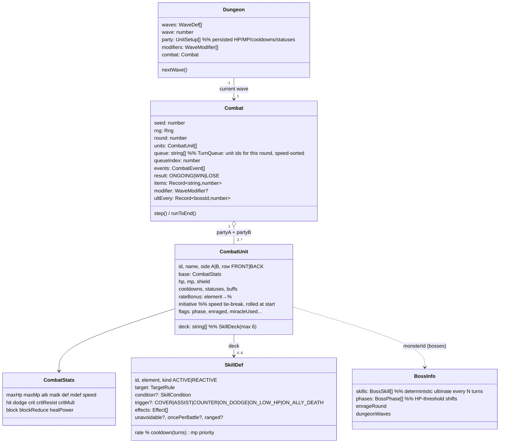

# Combat Spec — Party Auto Turn-Based Engine (Pockie-Ninja style)

> Implements the brief "Party-Based Auto Turn-Based Combat Engine with Conditional RNG Mechanics"
> (3v3, dungeon waves, bosses). Code: `packages/shared/src/combat/` · data: `packages/shared/src/data/skills.ts`,
> `monsters.ts` · client: `apps/game/src/scenes/BattleScene.ts`. Tests: `combat/combat.test.ts`, `rules/balance.test.ts`.

**Hard rule:** the engine is deterministic from `(CombatConfig, seed, inputs)` — every roll uses the combat RNG
(`createRng`) and the only player decisions are the recorded `CombatConfig.inputs` (Awakening presses, §3b).
`replayCombat(cfg)` reproduces a fight exactly, which is what a server will use to verify results.
Dungeons log inputs per wave (`Dungeon.inputs`, `addInput(d, input)`), and `createDungeon({ …, inputs })` replays them.

---

## 1. Data model (class diagram)



`Party` = the `partyA` / `partyB` arrays of `UnitSetup` in `CombatConfig` (up to 3 per side in normal play;
bosses may summon extra units). The player's party is `[player]` today; companions/Mercenaries plug in as more
`UnitSetup`s with no engine change.

---

## 2. Turn pipeline & RNG resolver

**Initiative queue:** at each round start the alive units are sorted by effective `speed` (buffs, Slow);
ties use `initiative`, a random roll made once at battle start. Each unit acts once per round.

```text
takeTurn(unit):
  tick cooldowns (−1)
  ── Step 1  STATUS PHASE
  for DoT in [POISON (% maxHP, bosses capped 1%), BURN (caster MATK × potency), BLEED]: deal TRUE damage
  if unit has STUN | FREEZE | ROOT: emit SKIP, end turn
  ── Step 2  PRE-ACTION
  if player & HP < 30% & potion: drink (uses the turn)
  if boss & (turnsTaken+1) % ultEvery == 0: DETERMINISTIC ULTIMATE (unavoidable), end turn
  ── Step 3  LAYER 1: SKILL LAUNCH ROLL
  candidates = deck ACTIVE skills where cooldown==0 ∧ mp ≥ cost ∧ condition met, sorted by priority desc
  for skill in candidates:
      Final_Rate = base rate + unit.rateBonus[element|ALL] (gear/outfit, boss phase) + wave modifier
      if roll(0..100) < Final_Rate: chosen = skill; break
  else chosen = basic_attack
  useSkill(unit, chosen)
  end turn: statuses/buffs/shields −1 turn

useSkill(u, skill):
  pay MP, set cooldown
  ── Step 4  LAYER 2: TARGETING
  targets = resolve(rule):  SELF | ALL_ALLIES | ALLY_LOWEST_HP | ALL_ENEMIES
            single enemy:   TAUNTING foe → forced
                            ENEMY_LOWEST_HP → min HP%
                            ENEMY_BACK → back row if any
                            ENEMY → FRONT 70% / BACK 30% (if both rows exist), uniform inside the row
  if single target & not unavoidable:  COVER trigger — an ally of the target with a COVER skill rolls its rate;
                                       success → guard becomes the target, takes 70% damage
  ── Step 5  LAYER 3: PER STRIKE (hits × chain targets)
  hit    = clamp(att.hit − tgt.dodge, 5%, 100%)   → fail: MISS, target ON_DODGE trigger, no on-hit effects
  crit   = forceCrit ∨ roll < att.crit − tgt.critResist (enraged: always)  → × critMult
  dmg    = Σ scaling × stats × falloff × element(1.5 weak / 0.75 resist) → DEF/MDEF mitigation
  block  = roll < tgt.block → × (1 − blockReduce)          (unavoidable skips hit & block)
  mutations (Pure Tank reduce/reflect, Pure Mage ×5, Pure DEX, Pure Strength execute, Pure Luck miracle)
  apply: shield → HP → DEATH / ON_LOW_HP / boss PHASE checks
  status effects only on targets that were actually hit; buffs/heals/shields on resolved allies
  ── Step 6  REACTIVE (cross-party)
  for each target hit and alive: COUNTER trigger → strike back at attacker
  first ally of attacker whose ASSIST trigger succeeds → out-of-turn strike on the same target
  (reactive actions never chain further reactives, except deaths)
```

Implementation: `takeTurn`, `useSkill`, `strike`, `damage` in `combat/engine.ts`.

---

## 3. Event system (cross-party triggers)

Two layers, both synchronous so the result stays deterministic:

| Brief hook | Engine trigger | Fired from | Who listens |
|---|---|---|---|
| `OnAttack` (target declared) | `COVER` | `useSkill` before any roll | allies of the declared target |
| `OnHit` | `COUNTER` | after the action, per target hit | the target |
| `OnHit` (ally landed a hit) | `ASSIST` | after the action | allies of the attacker (first success) |
| `OnAllyHit` / low HP | `ON_LOW_HP` | `damage()` when HP crosses 30% | the damaged unit (once) |
| dodge | `ON_DODGE` | `strike()` on MISS | the dodger |
| `OnDeath` | `ON_ALLY_DEATH` | `damage()` on HP 0 | every surviving ally (rage buffs, emergency shields, vengeance strike on the killer) |

A trigger is just a `REACTIVE` skill in the deck: `reactiveRoll(unit, trigger)` scans the deck, rolls each
matching skill's launch rate (same formula as Layer 1, `oncePerBattle` respected) and executes it with
`useSkill(..., { reactive })`.

The second layer is the **`CombatEvent` log** (`combat.events`): every roll outcome is appended
(`TURN, SKILL{reactive?}, MISS, DAMAGE{crit,block}, COVER, STATUS, TICK, SHIELD, BUFF, DEATH, PHASE, ENRAGE,
WAVE, RECOVER, ITEM, SUMMON, END…`). The client consumes it to animate (`BattleScene.animate`) and a server can
diff it on replay. Nothing in the UI influences the outcome except the recorded inputs below.

### 3b. Player agency (`combat/awaken.ts`, tests `combat/awaken.test.ts`)
- **Awakening gauge** (players only: side A with a class, not passive): +6 per landed hit dealt, +4 per landed hit
  taken (was 10/14 — it filled by round 3; playtest 2026-09-25), cap 100, carried between dungeon waves (`UnitSetup.awaken`). Monsters never have one.
- **Input** `{ unit, turn, kind: 'AWAKEN', grade }`: applies on the unit's first turn with `turnsTaken >= turn` that isn't
  skipped by hard CC; read right after the status/CC phase (before potions). Consumed once; ignored if the gauge isn't full.
- **Awakening Strike**: `AWAKEN` event, then an unavoidable strike on `ENEMY_LOWEST_HP` scaling the unit's higher of
  ATK/MATK × 3.0 (PERFECT) / 2.4 (GOOD) / 1.8 (MISS) — crit can still roll; gauge → 0.
  Grade comes from the client timing ring (±90 ms PERFECT, ±220 ms GOOD) — it is client-reported, so the spread is kept small.
- **Link Attack**: a landed hit by an ally on the same target another ally hit last, in the same round → ×1.15 and a
  `LINK` event before the `DAMAGE`. `combat.lastHit` tracks the chain; any enemy hit breaks it. Party fights only by nature.
- Party runs (every member simulates the same fight) don't offer Awakening yet — presses would have to be relayed
  through the server before the turn resolves. Solo fields/gates/trials/arena and auto-hunt (auto GOOD) do.

---

## 4. Bosses & dungeons

- **Deterministic ultimate** (`BossInfo.skills[0]`): every Nth boss turn, unavoidable (no miss/block).
  Plan around it with Taunt, shields (Iron Wall / Mana Shield / Last Prayer) or Pure Tank's once-per-fight block.
- **Monster decks scale with level** (2026-09-23): `MonsterDef.deck` lists signature skills in unlock order and
  `monsterDeck()` keeps the first `monsterSkillSlots(level)` of them (Lv 1-7: 1, 8-15: 2, 16-23: 3, 24+: 4; bosses: all).
- **Phase shift** (`BossInfo.phases`): at `hpBelow` the boss multiplies stats, gains launch-rate bonus, adds deck
  skills and may speed up its ultimate cadence (`everyTurns`). Emits `PHASE`.
- **Enrage** (`enrageRound`): after N rounds → 100% crit, ×10 ATK/MATK. Emits `ENRAGE`.
- **Dungeon waves** (`combat/dungeon.ts`): landmark bosses run `dungeonWaves` minions then the boss.
  (Every new fight/run starts at full HP/MP — the client sends setups without hp/mp; see MASTER_SPEC §9.)
  HP, MP, statuses and cooldowns persist between waves; each wave rolls a `WaveModifier`
  (heatwave, monsoon, cursed −30% heal, frenzy, miasma DoT, focus, calm);
  each surviving Cleric rolls 50% to heal the party 15% between waves (`RECOVER`).
- **World boss**: single boss wave with shared HP, 20-round attack window.

---

## 5. JSON schema (skill / deck configuration)

```json
{
  "$schema": "https://json-schema.org/draft/2020-12/schema",
  "$id": "pixel-walker/skill.json",
  "type": "object",
  "required": ["id", "kind", "element", "rate", "cooldown", "mp", "priority", "target", "effects"],
  "properties": {
    "id": { "type": "string" },
    "nameTh": { "type": "string" },
    "kind": { "enum": ["ACTIVE", "REACTIVE"] },
    "element": { "enum": ["NEUTRAL", "FIRE", "WATER", "LIGHTNING", "EARTH", "HOLY", "SHADOW"] },
    "rate": { "type": "number", "minimum": 0, "maximum": 100, "description": "base activation %" },
    "cooldown": { "type": "integer", "minimum": 0, "description": "owner turns" },
    "mp": { "type": "integer", "minimum": 0 },
    "priority": { "type": "integer", "description": "higher is rolled first" },
    "target": { "enum": ["ENEMY", "ENEMY_LOWEST_HP", "ENEMY_BACK", "ALL_ENEMIES", "SELF", "ALLY_LOWEST_HP", "ALL_ALLIES"] },
    "condition": { "enum": ["SELF_HP_BELOW_60", "SELF_HP_BELOW_40", "ALLY_HP_BELOW_60", "ENEMY_COUNT_2PLUS"] },
    "trigger": { "enum": ["COVER", "ASSIST", "COUNTER", "ON_DODGE", "ON_LOW_HP", "ON_ALLY_DEATH"] },
    "unavoidable": { "type": "boolean" },
    "oncePerBattle": { "type": "boolean" },
    "effects": {
      "type": "array",
      "items": {
        "oneOf": [
          { "properties": { "kind": { "const": "DAMAGE" }, "type": { "enum": ["PHYSICAL", "MAGIC", "TRUE"] },
            "scaling": { "type": "object" }, "hits": { "type": "integer" },
            "chain": { "type": "object", "properties": { "jumps": { "type": "integer" }, "falloff": { "type": "number" } } },
            "forceCrit": { "type": "boolean" } }, "required": ["kind", "type", "scaling"] },
          { "properties": { "kind": { "const": "HEAL" }, "scaling": { "type": "object" }, "flat": { "type": "number" } }, "required": ["kind", "scaling"] },
          { "properties": { "kind": { "const": "STATUS" }, "status": { "enum": ["STUN", "FREEZE", "POISON", "BURN", "BLEED", "SLOW", "TAUNTING", "ROOT"] },
            "turns": { "type": "integer" }, "chance": { "type": "number" }, "potency": { "type": "number" }, "self": { "type": "boolean" } }, "required": ["kind", "status", "turns"] },
          { "properties": { "kind": { "const": "BUFF" }, "stat": { "type": "string" }, "pct": { "type": "number" }, "turns": { "type": "integer" } }, "required": ["kind", "stat", "pct", "turns"] },
          { "properties": { "kind": { "const": "SHIELD" }, "pctMaxHp": { "type": "number" }, "turns": { "type": "integer" } }, "required": ["kind", "pctMaxHp", "turns"] },
          { "properties": { "kind": { "const": "CLEANSE" } }, "required": ["kind"] }
        ]
      }
    }
  }
}
```

### Example: a Knight's deck (as stored + resolved)

```json
{
  "unit": { "id": "me", "classId": "KNIGHT", "row": "FRONT", "rateBonus": { "FIRE": 10 } },
  "deck": ["shield_bash", "taunt", "guardian", "iron_wall", "power_smash", "stone_throw"],
  "skills": {
    "shield_bash": { "kind": "ACTIVE", "element": "NEUTRAL", "rate": 30, "cooldown": 2, "mp": 10, "priority": 0,
      "target": "ENEMY",
      "effects": [
        { "kind": "DAMAGE", "type": "PHYSICAL", "scaling": { "atk": 1.2, "def": 1.5 } },
        { "kind": "STATUS", "status": "STUN", "turns": 1, "chance": 0.6 }
      ] },
    "taunt": { "kind": "ACTIVE", "element": "NEUTRAL", "rate": 25, "cooldown": 4, "mp": 12, "priority": 3,
      "target": "SELF",
      "effects": [
        { "kind": "STATUS", "status": "TAUNTING", "turns": 2, "self": true },
        { "kind": "BUFF", "stat": "def", "pct": 0.3, "turns": 2, "self": true }
      ] },
    "guardian": { "kind": "REACTIVE", "trigger": "COVER", "element": "NEUTRAL", "rate": 35, "cooldown": 0, "mp": 0,
      "priority": 0, "target": "SELF", "effects": [] },
    "iron_wall": { "kind": "REACTIVE", "trigger": "ON_LOW_HP", "oncePerBattle": true, "element": "NEUTRAL", "rate": 100,
      "cooldown": 0, "mp": 0, "priority": 0, "target": "SELF",
      "effects": [{ "kind": "SHIELD", "pctMaxHp": 0.5, "turns": 3 }] }
  }
}
```

---

## 5b. Novice skill pool & starter deck

Novice has four skills only (`CLASSES.NOVICE.skills`); the basic attack remains an implicit fallback,
not a deck skill. Every advanced class retains this small Novice pool alongside its own four skills
(`classSkillPool`). The starter deck contains every Novice skill:

| Type | Skill | Effect |
|---|---|---|
| Attack | Rush | Heavy single-target attack (180% ATK) |
| Attack | Throw Stone | Ranged attack that prefers the back row (110% ATK) |
| Buff | Focus | Temporarily grants ATK +1 |
| Reactive | Counter Tackle | On being hit, has a chance to tackle back (60% ATK) |

The four internal IDs remain `power_smash`, `stone_throw`, `focus`, and `counter_jab` so the existing
icons and compatible saved loadouts can continue to work.

## 6. Decisions vs. the brief

| Brief | Pixel Walker | Why |
|---|---|---|
| 3v3 parties | Engine supports N v N (2 rows/side); the player fights solo for now | No companions/Mercenaries yet — they plug in as extra `UnitSetup`s |
| "Outfit element bonus" | `rateBonus` per element on the unit (gear/phase) + wave modifier | Gear items can grant element launch % later without engine changes |
| Crit multiplier 1.5–2.0 | Players 1.6, monsters 1.5 | Tunable per unit via `critMult` |
| No MP in the brief | MP is a real resource: skills cost 6–45 MP; a skill without enough MP is never rolled; players auto-drink MP potions below 25% (HP potions below 30% first) | Makes MP potions and INT meaningful: without MP potions a Lv.10 Novice runs dry in ~70% of Goblin dungeon runs |
| Status durations | In the affected unit's turns | Consistent with turn-based pacing |
| Speed-strict order | One action per unit per round, speed-sorted | Predictable for players planning around boss ultimates |

### Balance targets (Monte-Carlo, `rules/balance.test.ts`)
| Scenario | Target | Current |
|---|---|---|
| Lv.1 Novice vs slime | > 95% | ✅ |
| Lv.5 Novice vs 2 rats | > 80% | ✅ |
| Lv.10 Novice, Goblin King dungeon (3 waves) | 30–95% | ~35% |
| Lv.12 Knight (mid gear), Goblin King dungeon | > 80% | ~100% |
| Lv.20 Knight, Octane dungeon | 20–90% | ~31% |
